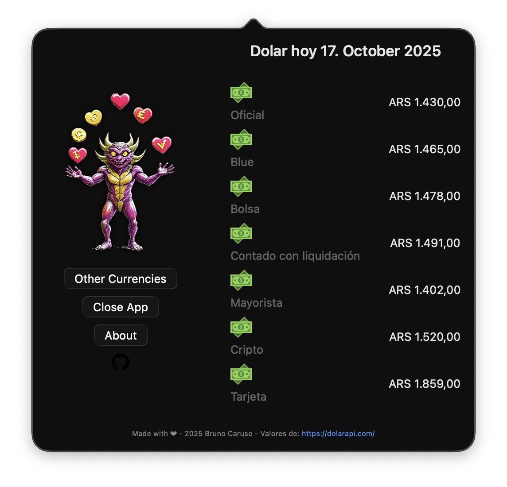

<h2 align="center">
  Dolaruco-app 💵
</h2>

## Table of Contents

- [Description](#description)
- [The Problem](#the-problem)
- [The Solution](#the-solution)
- [Features](#features)
- [To-do](#to-do)

## Description

Dolaruco-app is a simple, lightweight, and minimal macOS menu bar application built with SwiftUI. It's designed for a singular, essential purpose: to provide instant and easily accessible updates on the US dollar exchange rates against the Argentine Peso.

## The Problem

Due to the high volatility of the Argentine Peso, staying informed about currency exchange rates is a daily necessity for many Argentines, both locally and those living or working abroad. However, most financial apps are often bloated and not focused on the specific, complex reality of the Argentine currency market.

## The Solution

Dolaruco-app lives discreetly in your macOS menu bar, providing a clean and non-intrusive way to check the current dollar rates. It focuses on the different "street" prices that are commonly known in Argentina, giving users a comprehensive view of the market.

## Features

At the moment, Dolaruco-app displays the following US dollar exchange rates against the Argentine Peso:

- **Dolar Oficial**: The official exchange rate set by the government.
- **Dolar Blue**: The informal or "blue" market rate.
- **Dolar Bolsa**: The MEP (Mercado Electrónico de Pagos) rate, which is a financial exchange rate.
- **Dolar Crypto**: The cryptocurrency exchange rate for USDT.
- **Dolar Tarjeta**: The "card" dollar rate, used for foreign purchases.
- **Dolar Mayorista**: The wholesale dollar rate, used for commercial transactions.

## To-do

- [ ] Future update will include support for additional currencies related to the Argentine Peso: UYU, CLP, BRL.
- [ ] Icon made in Icon Composer
