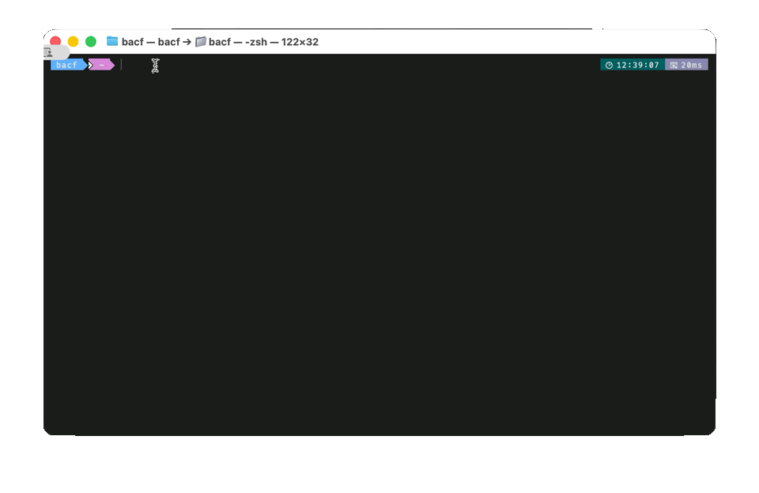

<h3 align="center"> Dolaruco App 💵 </h3>
<p align="center"></p>

<p align="center">


</p>

## Table of Contents

- [Description](#description)
- [The Problem](#the-problem)
- [The Solution](#the-solution)
- [Features](#features)
- [Preview](#preview)
- [Install](#install)
- [To-do](#to-do)

## Description

Dolaruco-app is a simple, lightweight, and minimal macOS menu bar application built with SwiftUI. It's designed for a singular, essential purpose: to provide instant and easily accessible updates on the US dollar exchange rates against the Argentine Peso.

## The Problem

Due to the high volatility of the Argentine Peso, staying informed about currency exchange rates is a daily necessity for many Argentines, both locally and those living or working abroad. However, most financial apps are often bloated and not focused on the specific, complex reality of the Argentine currency market.

## The Solution

Dolaruco-app lives discreetly in your macOS menu bar, providing a clean and non-intrusive way to check the current dollar rates. It focuses on the different "street" prices that are commonly known in Argentina, giving users a comprehensive view of the market.

## Features

At the moment, Dolaruco-app displays the following US dollar exchange rates against the Argentine Peso:

- **Dolar Oficial**: The official exchange rate set by the government.
- **Dolar Blue**: The informal or "blue" market rate.
- **Dolar Bolsa**: The MEP (Mercado Electrónico de Pagos) rate, which is a financial exchange rate.
- **Dolar Crypto**: The cryptocurrency exchange rate for USDT.
- **Dolar Tarjeta**: The "card" dollar rate, used for foreign purchases.
- **Dolar Mayorista**: The wholesale dollar rate, used for commercial transactions.

And also, theses currencies:

- **Uruguayan Peso.**
- **Chilean Peso.**
- **Brasilean Real.**
- **Euro.**

## Preview

https://github.com/user-attachments/assets/3754db72-00ba-4152-b07d-d1da8c1ebacd

<p align="center"></p>


## Install

Download the latest version from the [releases](https://github.com/bacf5/dolaruco-app/releases/latest) page, or use [Homebrew](https://brew.sh/):

```sh
brew install bacf5/dolarucoapp/dolarucoapp
```

<p align="center"></p>


> [!IMPORTANT]
> I don't have an Apple Developer account yet. The application will show a popup on first launch that the app is from an unidentified developer.
> 1. Click **OK** to close the popup.
> 2. Open **System Settings** > **Privacy & Security**.
> 3. Scroll down and click **Open Anyway** next to the warning about the app.
> 4. Confirm your choice if prompted.
>
> You only need to do this once.

If you’ve checked the source code and know it’s safe, you can install it this way adding the flag "--no-quarantine" instead of changing system settings.

```sh
brew install bacf5/dolarucoapp/dolarucoapp --no-quarantine
```

## To-do

- [X] ~~Future update will include support for additional currencies related to the Argentine Peso: UYU, CLP, BRL and EUR.~~
- [X] ~~Icon made in Icon Composer.~~
- [X] ~~Make a MacOS installer to easy install & updates.~~ (Via homebrew)
- [ ] Check prices offered from saldo.com.ar
<!--- [ ] Integrate Sparkle Updater / maybe in the future, for now brew install & update are good -->

